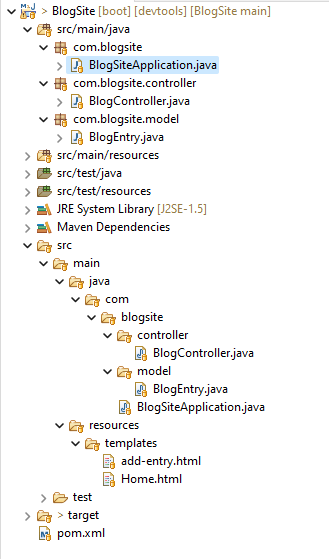
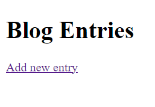
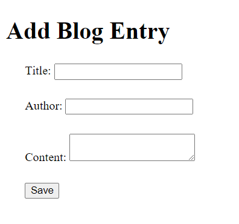
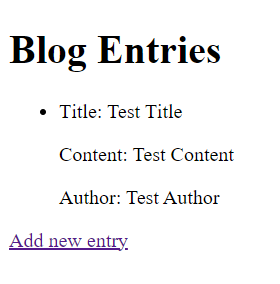

# MVC-Example-Web

## Tasarım Desenleri Ödevi

Model -> BlogEntry.java  
View -> HTML Dosyaları (add-entry.html ve Home.html)  
Controller -> BlogController.java  

Bu projede Controller sayfa yönlendirmelerini ve modelimiz olan BlogEntry'lerini kaydetme işlemini gerçekleştiriyor. Daha sonra modelimiz view katmanında HTML dosyaları aracılığıyla kullanıcıya gösteriliyor.

## Klasör Yapısı

## Anasayfa

## Yazı Ekleme Sayfası

## Blog Yazısının Anasayfada gösterilmesi

